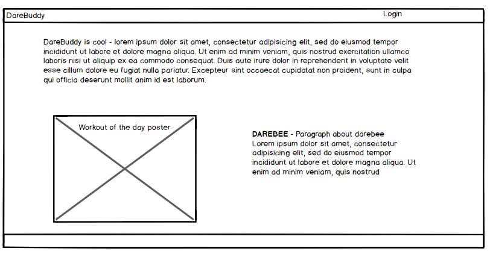
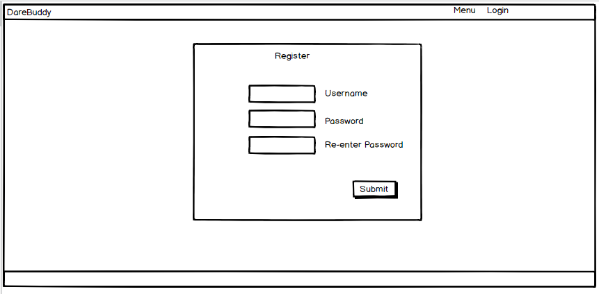
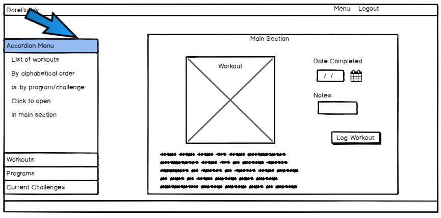
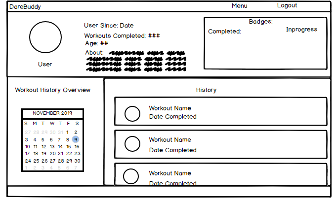
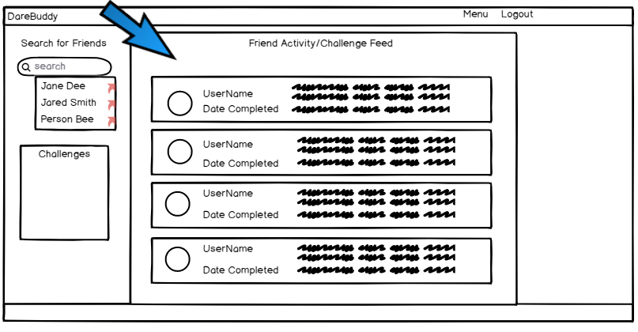

# DareBuddy
## Fitness for Everyone
Most of us have fitness goals but when it comes to actually implementing those goals many of us will run into stumbling blocks such as lack of knowledge or lack of motivation and consistency.  DareBuddy will help.  Although there are currently many fitness resources available they are either expensive, focus on a specific fitness population (Run Trackers, Starting Strength App) or they fail to address all of the needs of their target audience (Fitocracy - has social and tracking but limited information/programs unless you pay for a trainer). 
DareBuddy wants to solve this problem.  It will use the world-class, open source fitness content provided by DAREBEE to provide users with information in the form of workouts and programs that fit their life and their goals.  It will help users stay consistent by implementing a workout tracking system with optional reminders.  It will provide motivation in the form of tracking and by creating a community of fitness seekers who can interact via challenges and messages.  

## Overview

### Landing

### Register

### Log a Workout

### User

### Activity Feed

## Resources
### Darebee
[DAREBEE](https://darebee.com/programs.html) is a free, open source, nonprofit global fitness resource.  They are supported by user donations so if you like what you see consider [becoming a donor.  Even small donations make a difference!](https://darebee.com/support.html)

### More coming

## Author
Tierra Farris
